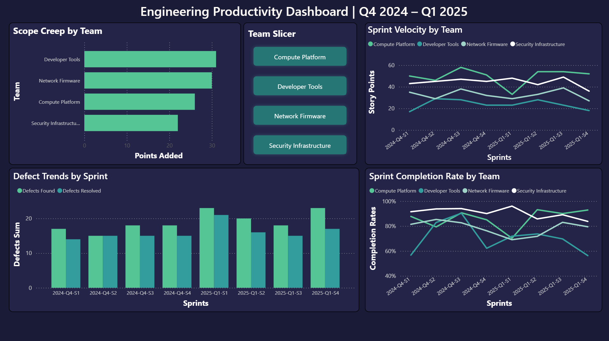

# engineering-metrics-dashboard

A Power BI dashboard tracking sprint delivery performance, defect trends, completion rates, and scope changes across a simulated multi-team software engineering organization.

Built to demonstrate engineering analytics and BI reporting workflows relevant to roles in engineering insights, product operations, and technical program management.

## Overview

This dashboard simulates the kind of sprint metrics reporting an engineering insights analyst would maintain for a software division. It covers 4 engineering teams across 8 two-week sprints (Q4 2024 – Q1 2025).

**Teams tracked:**
- Compute Platform
- Network Firmware
- Security Infrastructure
- Developer Tools

## Visuals

| Visual | Description |
|---|---|
| Sprint Velocity by Team | Completed story points per sprint per team — used to assess delivery consistency and capacity trends |
| Sprint Completion Rate by Team | Ratio of completed to planned points — highlights teams with recurring overcommitment or scope issues |
| Defect Trends by Sprint | Defects found vs. resolved per sprint — surfaces unresolved defect backlog building over time |
| Scope Creep by Team | Total story points added mid-sprint per team — identifies teams with unstable sprint planning |

All visuals are filterable by team using the Team Slicer.

## Data Model

Three CSV files connected via a relational model in Power BI:

**sprints.csv** — One row per team per sprint. Fields: sprint_id, sprint_label, team_id, team_name, start_date, end_date, planned_points, completed_points, defects_found, defects_resolved

**teams.csv** — Team reference table. Fields: team_id, team_name, team_size, product_area

**scope_changes.csv** — Mid-sprint scope addition events. Fields: sprint_id, sprint_label, team_id, team_name, stories_added, points_added

**Calculated columns (DAX):**
- `completion_rate = sprints[completed_points] / sprints[planned_points]`
- `defect_resolution_rate = DIVIDE(sprints[defects_resolved], sprints[defects_found], 0)`

## Key Findings

- **Compute Platform** consistently delivered the highest velocity but showed a sharp dip in 2025-Q1-S1, recovering in subsequent sprints
- **Developer Tools** had the most volatile completion rate, dropping below 60% in two sprints — indicating recurring overcommitment relative to team capacity
- **Defect backlog** grew across Q1 2025 as defects found outpaced defects resolved, particularly in 2025-Q1-S1 and 2025-Q1-S4
- **Developer Tools and Network Firmware** accounted for the most mid-sprint scope additions, suggesting sprint planning instability

## Tools

- Power BI Desktop
- SQL (data modeling and calculated columns)
- Excel (data preparation)
